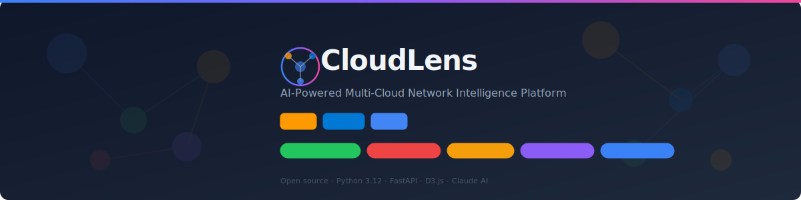
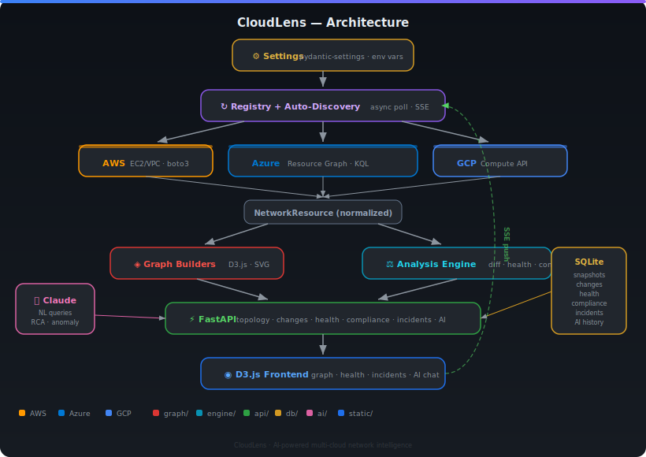

<p align="center">
  
</p>

<p align="center">
  <a href="#quick-start">Quick Start</a> ·
  <a href="#features">Features</a> ·
  <a href="#architecture">Architecture</a> ·
  <a href="#configuration">Configuration</a> ·
  <a href="#api-reference">API Reference</a> ·
  <a href="#contributing">Contributing</a>
</p>

<p align="center">
  
  
  
  
</p>

---

**CloudLens** is an open-source network intelligence platform that continuously monitors your cloud topology across AWS, Azure, and GCP. It detects changes, runs health checks, evaluates compliance, analyzes blast radius, manages incidents, and provides AI-powered insights — all through a real-time web interface.

Built for SREs who are tired of being a human topology cache across three cloud consoles.

---

## Quick Start

### Local development

```bash
git clone https://github.com/aminueza/cloudlens.git
cd cloudlens
pip install ".[dev]"

# Azure
az login
CLOUDLENS_AUTH_DISABLED=true python3 main.py

# AWS
export AWS_PROFILE=your-profile
ENABLED_PROVIDERS=aws CLOUDLENS_AUTH_DISABLED=true python3 main.py

# All providers
pip install ".[all-providers,dev]"
ENABLED_PROVIDERS=aws,azure,gcp CLOUDLENS_AUTH_DISABLED=true python3 main.py
```

Open [http://localhost:8050](http://localhost:8050)

### With AI assistant

```bash
export ANTHROPIC_API_KEY="sk-ant-api03-..."
CLOUDLENS_AUTH_DISABLED=true python3 main.py
```

Get an API key at [console.anthropic.com/settings/keys](https://console.anthropic.com/settings/keys). AI features degrade gracefully without it — the platform works fully, just with basic keyword-matched answers instead of Claude-powered analysis.

### Docker

```bash
docker build -t cloudlens .
docker run -p 8050:8050 \
  -e CLOUDLENS_AUTH_DISABLED=true \
  -e ENABLED_PROVIDERS=azure \
  -e ANTHROPIC_API_KEY="sk-ant-..." \
  cloudlens
```

---

## Features

### Multi-Cloud Topology Visualization

Interactive D3.js force-directed graph that renders your entire network across all cloud providers. VPCs/VNets cluster by product, tint by provider (AWS orange, Azure blue, GCP blue). Filter by environment, search by name, click any node to inspect.

### Change Tracking

Every poll cycle, CloudLens snapshots the topology to SQLite and diffs it against the previous state. New network? Logged. Peering disconnected? Logged with severity "critical." Security group removed from production? You'll know before your next coffee.

### Health Checks (10 automated checks)

| Check | Severity | Detects |
|---|---|---|
| Disconnected peering | Critical | Non-active peerings across any provider |
| Empty security group | Warning | SGs/NSGs with 0 rules |
| Orphaned resource | Warning | Resources not linked to any network |
| Address overlap | Critical | Overlapping CIDRs within same environment |
| Missing firewall | Critical | Production networks without firewall protection |
| Missing security group | Warning | Production networks without SGs |
| Isolated network | Warning | Networks with resources but no peerings |
| Provisioning failed | Critical/Warning | Resources not in succeeded/active state |
| Cross-cloud gap | Warning | Product exists in one provider but not another |
| Default security group | Warning | AWS default SGs with allow-all rules |

Results feed into an **A-F health score** visible in the header.

### Compliance Engine

7 default rules out of the box. Add custom rules via the API. Evaluated on every poll cycle:

```bash
curl -X POST http://localhost:8050/api/compliance/rules \
  -H "Content-Type: application/json" \
  -d '{"name":"prod-firewall","description":"Every prod network must have a firewall","severity":"critical","rule_type":"require_resource","rule_config":{"env":"prd","resource_type":"firewall"}}'
```

Rule types: `require_resource`, `peering_connected`, `sg_has_rules`, `address_overlap`, `subnet_has_sg`, `no_orphan_resource`

### Blast Radius Analysis

Click any resource and ask "what happens if this goes down?" CloudLens traces peering chains up to 3 hops deep — including cross-cloud connections — and uses **Tarjan's algorithm** to find articulation points (single points of failure in the peering graph).

### Incident Management

Create incidents with automatic topology snapshot capture, health issue enrichment, and AI-powered root cause analysis. Track status, add annotations, view timeline of changes correlated with the incident.

### AI Intelligence (Claude)

| Capability | Example |
|---|---|
| Natural language queries | "Which production networks don't have a firewall?" |
| Change risk analysis | "8 resources changed in the last hour. Is this a deployment?" |
| Root cause analysis | Correlates health failures + changes + topology |
| Compliance recommendations | Prioritized remediation with CLI commands |
| Anomaly detection | Rapid removal, environment drift, cross-cloud divergence |

---

## Architecture

<p align="center">
  
</p>

### Key design decisions

- **Provider isolation** — Cloud SDKs live in `providers/` and nowhere else. Core modules are cloud-agnostic.
- **Optional dependencies** — `pip install cloudlens[aws]` for AWS only. No need to install Azure SDK if you only use AWS.
- **Single worker** — BackgroundFetcher + SQLite are not multi-process safe. One worker avoids duplicate queries and write contention.
- **Per-provider auth** — Each provider tracks its own auth state. AWS healthy + Azure expired = fetcher continues for AWS, retries Azure on 60s backoff.
- **AI fallbacks** — Every AI function works without an API key. Rule-based heuristics run always.

---

## Configuration

| Variable | Default | Description |
|---|---|---|
| `ENABLED_PROVIDERS` | `azure` | Comma-separated: `aws`, `azure`, `gcp` |
| `CLOUDLENS_POLL_INTERVAL` | `300` | Background poll interval (seconds) |
| `CLOUDLENS_AUTH_DISABLED` | `false` | Disable auth for local development |
| `CLOUDLENS_CORS_ORIGINS` | `*` | Allowed CORS origins |
| `ANTHROPIC_API_KEY` | `""` | Claude API key for AI features (optional) |
| `AI_MODEL` | `claude-sonnet-4-20250514` | Claude model to use |
| `DB_PATH` | `data/cloudlens.db` | SQLite database path |
| `SNAPSHOT_RETENTION` | `100` | Max snapshots to keep per scope |
### Auto-Discovery

CloudLens **automatically discovers** all networks, subscriptions, and accounts from each enabled provider using the authenticated credentials. No static account configuration is needed.

- **Azure**: Lists all enabled subscriptions via `SubscriptionClient` and queries Azure Resource Graph across all of them.
- **AWS**: Discovers the current account via STS and lists all enabled regions via EC2 `describe_regions`.
- **GCP**: *(Stub)* — will auto-discover projects when SDK is installed.

Product names shown in the UI are derived by stripping `-dev`, `-stg`, `-prd`, `-global` suffixes from the discovered subscription/account display names.

---

## API Reference

### Topology
| Method | Path | Description |
|---|---|---|
| `GET` | `/api/topology/{scope}/structured` | Hierarchical topology (D3.js format) |
| `GET` | `/api/topology/{scope}` | Flat graph (nodes + edges) |
| `GET` | `/api/svg/{scope}` | Download SVG diagram |
| `GET` | `/api/events` | SSE stream (update + auth_error events) |
| `GET` | `/api/accounts` | List discovered products |

### Changes
| Method | Path | Description |
|---|---|---|
| `GET` | `/api/changes/{scope}` | Recent changes with summary |
| `GET` | `/api/changes/{scope}/analyze` | AI change risk analysis |
| `GET` | `/api/snapshots/{scope}` | Available snapshots |

### Health & Compliance
| Method | Path | Description |
|---|---|---|
| `GET` | `/api/health/{scope}` | Health checks + A-F score |
| `GET` | `/api/health/{scope}/anomalies` | AI anomaly detection |
| `GET` | `/api/blast-radius/{resource_id}` | Impact analysis |
| `GET` | `/api/dependencies/{scope}` | Dependency graph + critical nodes |
| `GET/POST` | `/api/compliance/rules` | Manage compliance rules |
| `GET` | `/api/compliance/violations/{scope}` | Current violations |
| `POST` | `/api/compliance/evaluate/{scope}` | Run evaluation |

### Incidents
| Method | Path | Description |
|---|---|---|
| `POST` | `/api/incidents` | Create (auto-enriches with snapshot + health + AI) |
| `GET/PATCH` | `/api/incidents/{id}` | Read / update |
| `POST` | `/api/incidents/{id}/analyze` | AI root cause analysis |

### AI
| Method | Path | Description |
|---|---|---|
| `POST` | `/api/ai/query` | Natural language question |
| `GET` | `/api/ai/history` | Conversation history |

Use `all` as the scope to query across all providers and accounts.

---

## Development

```bash
# Install with dev dependencies
pip install ".[dev]"

# Run tests
pytest tests/ -v

# Lint
ruff check .

# Format
black --check .

# Type check
mypy config graph db engine ai api providers exporters
```

### Project Structure

```
providers/           Cloud provider abstraction
  base.py              ProviderInterface ABC + NetworkResource dataclass
  registry.py          Auto-loads enabled providers
  fetcher.py           BackgroundFetcher (poll + SSE + analysis)
  aws/client.py        AWS EC2/VPC → NetworkResource
  azure/client.py      Azure Resource Graph → NetworkResource
  gcp/client.py        GCP stub
graph/               Cloud-agnostic visualization
db/                  SQLite persistence (7 tables)
engine/              Diff, health, compliance, blast radius
ai/                  Claude integration + fallbacks
api/                 FastAPI routes + middleware
static/              D3.js frontend
```

### Adding a new provider

1. Create `providers/{name}/client.py` implementing `ProviderInterface`
2. Add optional dep in `pyproject.toml`
3. Register in `providers/registry.py`
4. Done — graph, engine, AI, and API modules need zero changes

---

## Contributing

Contributions welcome. Please:

1. Fork the repo
2. Create a feature branch
3. Write tests for new functionality
4. Ensure `ruff check .`, `black --check .`, and `pytest` pass
5. Open a PR

---

## License

MIT
